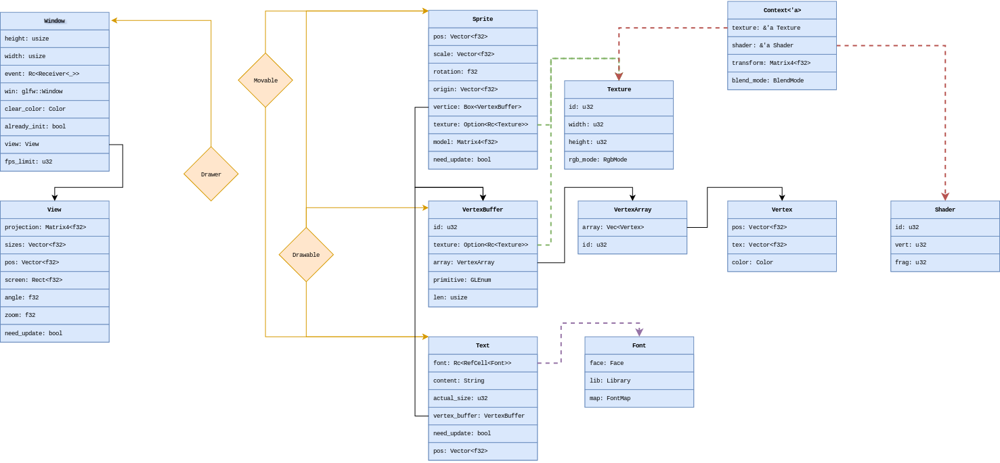

# Gust
Gust is a graphical library written in **pure** Rust from simple openGl binding and freetype-rs library.
The purpose of Gust is to help me to understand simple computer graphic system (2D) and to let me handle the complexe language that is Rust.

# Philosophy
The philosophy behind Gust is to make a simple, elegant, safe and reliable graphic library in Rust.
The key concepts and limitations are:

## Wrap OpenGl: Make it more simple to use and more rusty.

```Rust
use gust::prelude::*;

let window = Window::new(1920, 1080, "Hello World !");
let player_texture = Rc::new(Texture::from_path("assets/player.png"));
let mut player_sprite = Sprite::from(&player_texture);
let event_handler = EventHandler::new(&window);

player_sprite.set_position(Vector::new(1920. / 2., 1080. / 2.));

while window.is_open() {

    for event in event_handler.fetch() {
        match event.1 {
            Events::Key(Key::Escape, _, Action::Press, _) => { window.should_close() },
            _ => { /* Nothing happen */ }
        }
    }

    window.clear();
    window.draw(player_sprite);
    window.display();
}
println!("GoodBye !");
```

This simple code permit to create a window and draw on it until the user press escape key.

## No specific concept
There is no animations modules, no advanced event system, no multi-threaded rendering.

> (All of this will be implemented inside [Rame](http://github.com) which is another project based on this one)

The idea is that you can create this with Gust. It's not Gust job to provide you that kind of Api.

## Learning
It's my project and the idea behind it it's to learn as much as I can. So if something seems cool to implement I will probably do it.

## Example
I will preach Rust, so I have to show people the better rust code possible. Is acced to good programming practice and flow. (Nice git usage, documentation, unit test, bench-mark, beautiful and reliable) It is some sort of example for my peoples.

# What's inside Gust
Here you can see the UML Diagram.



And you can generate the doc by writing:

    cargo doc --open

and hitting ther `Enter` Key of your keyboard

> I Swear !

# How to contribute

You are welcome if you want to put your code into Gust, However you will have to make a proper pull-request get reviewed.
You should know that but it's important to understand that I want the best code possible, even if mine is not. I started rust only 6 month ago now.
You're allowed to pull-request your own concept if it follow the **Philosophy** and to correct or optimize my code. 

# Disclaimer

You should not use **Gust** *right now* or if you do it let **all** bug that you encounter into **issues** and why not think about fix them :D.

Thank you and you can read the [Wiki](https://github.com/Afourcat/Gust/wiki) if you are interested or look at my other projects.
